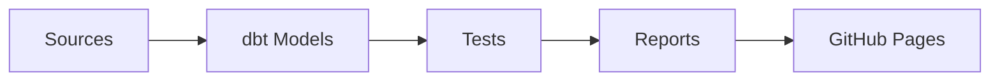
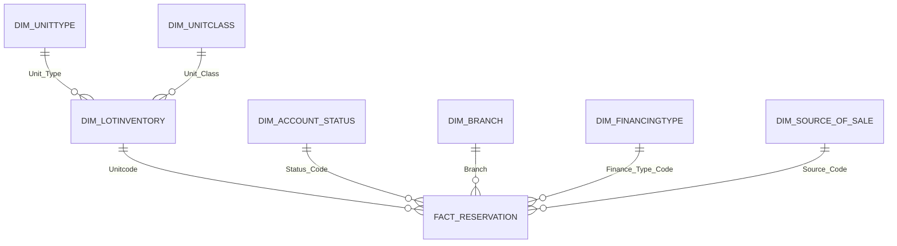

# dbt Project

Welcome to your new dbt project!  
This project transforms raw reservation and account data into analytics-ready tables and marts using **dbt** and **Snowflake**.

---

## 👥 Contributors

Thanks to everyone who has contributed to this project!

[](https://github.com/kyupeemyuseek-bot/newdw/graphs/contributors)

<a href="https://github.com/kyupeemyuseek-bot/newdw/graphs/contributors">
  
</a>


---

[](https://github.com/kyupeemyuseek-bot/newdw/actions/workflows/pubdbtdocs.yml)
[](https://github.com/kyupeemyuseek-bot/newdw/actions/workflows/dqrep.yml)
[](https://github.com/kyupeemyuseek-bot/newdw/actions/workflows/dbt%20CI%20tests.yml)

- 📊 [Data Quality Report](https://kyupeemyuseek-bot.github.io/newdw/dbt_data_quality_report.html)  
- 📚 [dbt Docs](https://kyupeemyuseek-bot.github.io/newdw/dbtdocs/)  
---

## 🚀 Project Overview
- **Warehouse:** Snowflake  
- **Tooling:** dbt Core  
- **Goal:** Build a modular transformation layer for reservations, clients, and related entities.  
- **Key Features:**  
  - Staging models to clean and standardize raw source data  
  - Fact and dimension models for analytics  
  - Data quality testing (`unique`, `not_null`)  
  - Experiments with **Snowflake materialized views**  
  - Data quality reporting script (`scripts/dq_report.py`)  

---

## 🗂️ Project Structure

 - /models
 - /staging        -- staging models (source → clean)
 - /marts          -- fact & dimension models
 - /demo           -- experimental models (clustering, materialized views)
 - /seeds            -- seed data for lookup tables
 - /macros           -- reusable SQL / Jinja macros
 - /tests            -- dbt tests
 - /scripts          -- helper scripts (e.g., dq\_report.py)

---

````markdown
# dbt Setup & Usage Guide

## ⚡ 1️⃣ Termux + dbt Core Setup (Snowflake)

Run these commands in Termux to install Python, Rust, dbt, and initialize a project:

```bash
# Update Termux packages
pkg update && pkg upgrade -y

# Install dependencies
pkg install git python python-pip clang make rust -y

# Upgrade pip, setuptools, wheel
pip install --upgrade pip setuptools wheel

# Install dbt Core (Snowflake adapter)
pip install dbt-snowflake

# Create dbt profiles folder
mkdir -p ~/.dbt

# Create example profiles.yml
cat > ~/.dbt/profiles.yml <<EOL
my_project:
  target: dev
  outputs:
    dev:
      type: snowflake
      account: <your_account>
      user: <your_user>
      password: <your_password>
      role: <your_role>
      database: <your_db>
      warehouse: <your_wh>
      schema: analytics
EOL

echo "✅ profiles.yml created at ~/.dbt/profiles.yml. Edit with your Snowflake credentials."

# Initialize a new dbt project
dbt init my_project
cd my_project

echo "✅ dbt project 'my_project' initialized."

# Optional: clone an existing repository
# git clone <your_repo_url>
# cd <repo_name>

# Test the setup
dbt debug
dbt run
dbt run -m stg_reservationhdr
dbt test

echo "🎉 dbt Core setup complete!"
````

> ⚠️ Older or low-end devices may experience slow installations, especially Rust dependencies.

## 2️⃣ dbt Cloud / Web UI Setup (Snowflake)

Follow these steps to connect your dbt project to dbt Cloud:

### 1. Sign up for dbt Cloud

Go to [dbt Cloud](https://cloud.getdbt.com/) and create an account.

### 2. Create a new project

* Choose **Connect to Git**
* Select your Git provider (GitHub, GitLab, Bitbucket)
* Authorize dbt Cloud to access your repository
* Pick the repository containing your dbt project

### 3. Set up your environment (Snowflake)

* Choose **Snowflake** as the data warehouse
* Enter the same credentials used in your `profiles.yml`:

  * `Account`, `User`, `Password`
  * `Role`, `Database`, `Warehouse`, `Schema`

### 4. Configure a dbt Cloud job (optional)

* Schedule runs (daily, hourly, etc.)
* Run all models or select specific models
* Add notifications for success or failure

### 5. Run dbt commands via the web UI

* `dbt debug` → Verify Snowflake connection
* `dbt run` → Run all models
* `dbt test` → Run tests
* Use the **IDE in dbt Cloud** to edit models online

### 6. Version control integration

* Changes made in the web UI can be committed via Git
* Use pull requests for code review and merging

> ✅ dbt Cloud provides a web IDE, scheduler, Snowflake integration, and Git workflow without requiring local dbt installation.

--

### 🏗️ Architecture / Workflow


## 🧱 Models

### Staging

* `stg_reservationhdr` → cleans reservation header data
* `stg_account_status` → standardizes account status codes

### Marts

* `fact_reservations` → fact table with transaction and client identifiers, prices, and keys

### Demo / Experiments

* `clustered_reservations` → clustering by `reservation_date, branchid` (Snowflake feature)
* Materialized views (Snowflake only, not fully dbt-native)

### Star Schema

---

## 🧪 Tests & Data Quality

* Schema tests: `unique`, `not_null` on key fields
* Custom data quality script: `scripts/dq_report.py` generates `dbt_data_quality_report.html`
* Test Data Quality Report via Great Expectation [Great_Expectation](https://github.com/kyupeemyuseek-bot/newdw/tree/8f9225e48add3d7a4bcefbe467571f5768890405/Data%20Quality%20Report)  

---

## 📜 Change Log


### August 20, 2025

## 📅 Project Changelog

### August 11, 2025
* Started first repo for practice
* Initial dbt setup and seed experiments

### August 12, 2025
* Tested connections to different databases
* Researched available tools for the project

### August 13, 2025
* Tried out local development with **dbt Core**
* Practiced running models locally

### August 14, 2025
* Discussed early project plans with collaborators

### August 15, 2025
* Tested connections to multiple databases (trial runs)
* Evaluated possible targets

### August 16, 2025
* Practiced Git workflows (branches, commits, pull requests)
* Decided which features to use for repo organization

### August 17, 2025
* Planned data warehouse & dbt strategy
* Decided on accounts and tools to use

### August 18, 2025
* Created fresh repo (`newdw`) for a clean start
* Set up base dbt project structure

### August 19, 2025
* Began adding initial data and seeds to Git

### August 20, 2025
* Started building `stg_` models and marts
* Checked lineage in dbt

### August 21, 2025
* Explored dbt **Docs**, **Reports**, and **Snapshots**

### August 22, 2025

* Moved `dq_report.py` into `/scripts`
* Generated first data quality report
* Drafted README and docs structure 
* Created GitHub Actions workflows (`.yml`) for reports and dbt docs
* Edited README to add badges and links
* Updated `main` branch based on changes from feature branches

### August 23, 2025

* Added snapshots
* Connected merge on main branch
* Added MDs
### August 24, 2025

*Completed dbt models
*Connected to Power BI

---

## ✅ Next Steps / TODO

* [X] Fix failing unique test on `stg_account_status`
* [X] Add `schema.yml` docs for fact models
* [x] Try dbt snapshots for slowly changing dimensions
* [x] Automate DQ report generation in CI/CD
* [ ] Make GitHub Pages `index.html` linking to reports, docs, and other artifacts
* [x] Review branches that are not updating / clean up unused ones
* [x] Reorganize folders for better project structure
* [x] Update `schema.yml` + `.md` files for seeds and practice schema
* [x] Explore BI tool options for project integration

---

## 📚 Resources

* [dbt Documentation](https://docs.getdbt.com/docs/introduction)
* [dbt Discourse](https://discourse.getdbt.com/)
* [dbt Community](https://getdbt.com/community)
* [dbt Blog](https://blog.getdbt.com/)

