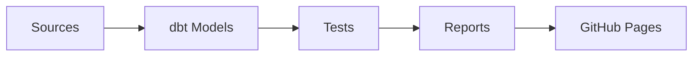

# dbt Project

Welcome to your new dbt project!  
This project transforms raw reservation and account data into analytics-ready tables and marts using **dbt** and **Snowflake**.

---

- 📊 [Data Quality Report](https://kyupeemyuseek-bot.github.io/newdw/dbt_data_quality_report.html)  
- 📚 [dbt Docs](https://kyupeemyuseek-bot.github.io/newdw/dbtdocs/)  
---

## 🚀 Project Overview
- **Warehouse:** Snowflake  
- **Tooling:** dbt Core  
- **Goal:** Build a modular transformation layer for reservations, clients, and related entities.  
- **Key Features:**  
  - Staging models to clean and standardize raw source data  
  - Fact and dimension models for analytics  
  - Data quality testing (`unique`, `not_null`)  
  - Experiments with **Snowflake materialized views**  
  - Data quality reporting script (`scripts/dq_report.py`)  

---

## 🗂️ Project Structure

/models
/staging        -- staging models (source → clean)
/marts          -- fact & dimension models
/demo           -- experimental models (clustering, materialized views)
/seeds            -- seed data for lookup tables
/macros           -- reusable SQL / Jinja macros
/tests            -- dbt tests
/scripts          -- helper scripts (e.g., dq\_report.py)

---

## ⚡ Setup Instructions

### 1. Prerequisites
- Python 3.8+  
- dbt Core installed (`pip install dbt-snowflake`)  
- Access to Snowflake warehouse  

### 2. Configure `profiles.yml`
Example:
yaml
my_project:
  target: dev
  outputs:
    dev:
      type: snowflake
      account: <your_account>
      user: <your_user>
      password: <your_password>
      role: <your_role>
      database: <your_db>
      warehouse: <your_wh>
      schema: analytics

### 3. Run dbt

bash
dbt run        # run all models
dbt run -m stg_reservationhdr   # run specific model
dbt test       # run tests

### 🏗️ Architecture / Workflow

## 🧱 Models

### Staging

* `stg_reservationhdr` → cleans reservation header data
* `stg_account_status` → standardizes account status codes

### Marts

* `fact_reservations` → fact table with transaction and client identifiers, prices, and keys

### Demo / Experiments

* `clustered_reservations` → clustering by `reservation_date, branchid` (Snowflake feature)
* Materialized views (Snowflake only, not fully dbt-native)

---

## 🧪 Tests & Data Quality

* Schema tests: `unique`, `not_null` on key fields
* Custom data quality script: `scripts/dq_report.py` generates `dbt_data_quality_report.html`
* Test Data Quality Report via Great Expectation [Great_Expectation](https://github.com/kyupeemyuseek-bot/newdw/tree/8f9225e48add3d7a4bcefbe467571f5768890405/Data%20Quality%20Report)  

---

## 📜 Change Log

### August 20, 2025

## 📅 Project Changelog

### August 11, 2025
* Started first repo for practice
* Initial dbt setup and seed experiments

### August 12, 2025
* Tested connections to different databases
* Researched available tools for the project

### August 13, 2025
* Tried out local development with **dbt Core**
* Practiced running models locally

### August 14, 2025
* Discussed early project plans with collaborators

### August 15, 2025
* Tested connections to multiple databases (trial runs)
* Evaluated possible targets

### August 16, 2025
* Practiced Git workflows (branches, commits, pull requests)
* Decided which features to use for repo organization

### August 17, 2025
* Planned data warehouse & dbt strategy
* Decided on accounts and tools to use

### August 18, 2025
* Created fresh repo (`newdw`) for a clean start
* Set up base dbt project structure

### August 19, 2025
* Began adding initial data and seeds to Git

### August 20, 2025
* Started building `stg_` models and marts
* Checked lineage in dbt

### August 21, 2025
* Explored dbt **Docs**, **Reports**, and **Snapshots**

### August 22, 2025

* Moved `dq_report.py` into `/scripts`
* Generated first data quality report
* Drafted README and docs structure 
* Created GitHub Actions workflows (`.yml`) for reports and dbt docs
* Edited README to add badges and links
* Updated `main` branch based on changes from feature branches

---

## ✅ Next Steps / TODO

* [ ] Fix failing unique test on `stg_account_status`
* [ ] Add `schema.yml` docs for fact models
* [ ] Try dbt snapshots for slowly changing dimensions
* [ ] Automate DQ report generation in CI/CD
* [ ] Make GitHub Pages `index.html` linking to reports, docs, and other artifacts
* [ ] Review branches that are not updating / clean up unused ones
* [ ] Reorganize folders for better project structure
* [ ] Update `schema.yml` + `.md` files for seeds and practice schema
* [ ] Explore BI tool options for project integration

---

## 📚 Resources

* [dbt Documentation](https://docs.getdbt.com/docs/introduction)
* [dbt Discourse](https://discourse.getdbt.com/)
* [dbt Community](https://getdbt.com/community)
* [dbt Blog](https://blog.getdbt.com/)

